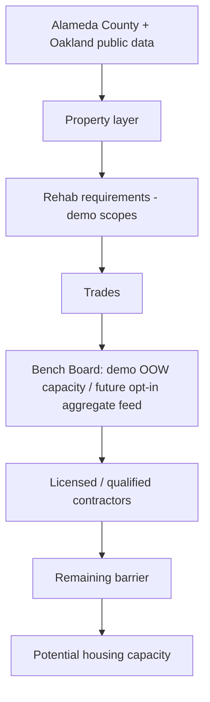

# BenchBridge

Buildings are waiting. Workers are waiting. People are waiting for housing.

BenchBridge is a housing-activation and workforce decision-support map for Oakland. It shows candidate rehabilitation parcels, the modeled work required, the trades that work would need, a clearly labeled demo bench, and the blocker that still keeps the parcel from moving.

It is not a job board, a shelter locator, a dispatch system, or a position on project labor agreements. Participation by any union or hiring hall would be voluntary, aggregate, and revocable. No such agreement exists in this build.

## Architecture



Public GIS is cached under `data/`. `scripts/build_data.py` joins that cache to the demo seed and writes Parquet. FastAPI and DuckDB compute every headline number. The Next.js map reads those results. With `DEMO_MODE=true` the API refuses non-local network sockets.

## What is public, demo, or still missing

Public, cached from the source on 2026-10-03:

- Alameda County parcels: APN, situs, use code, land value, improvement value, assessed value, for candidate addresses that matched.
- Oakland CityOwnedProperties: APN, street, owner agency, use label, council district, ZIP, geometry. Contact fields were dropped. The extract is the first 80 Oakland features, not the full layer.
- Oakland Housing Element opportunity sites: APN, situs, year built, floor area, existing unit count, zoning code, use description, projected capacity by income band, inventory status, site type, geometry. The cache is buildings with year built and floor area, plus a West Oakland envelope. It is not the complete inventory. Owner names were not requested.

Demo:

- Candidate potential units, rehab tasks, costs, identified funds, funding gaps, worker-hours, and primary modeled blockers.
- A fictional bench of 64 workers by trade.
- Illustrative firms with synthetic `DEMO-` license numbers. Union status is unknown. They are not bids.

Partner data required:

- Real out-of-work counts. Dispatch. Inspections. Owner disposition. Environmental assessments. Bids. Project financing. The City's local-resident construction registry. Apprentice or resident shares.

A CSLB bulk file and the County qualified-contractor list were not downloaded. Environmental cleanup layers were not downloaded; the map says so. Asbestos is never inferred from age.

## Setup

Python 3.9 or newer. Node 20 or newer.

```bash
cd benchbridge
python3 -m venv .venv
source .venv/bin/activate
pip install -r requirements.txt
python scripts/build_data.py
DEMO_MODE=true WORKFORCE_SOURCE_MODE=DEMO uvicorn backend.app.main:app --port 8000
```

Or, from `benchbridge`:

```bash
make demo
```

That starts the API on port 8000 and the app on port 3010. Port 3000 is not used.

Open http://127.0.0.1:3010. Judge mode is http://127.0.0.1:3010/demo. Tests:

```bash
cd benchbridge
source .venv/bin/activate
pytest
```

Copy `.env.example` if you want the variable names in a file. The defaults are already demo mode. Leave `GEMINI_ENABLED` false. The app does not call Gemini.

## Routes

- `/` activation map
- `/building/BB-001` building record
- `/workforce` bench board
- `/scenario` deterministic what-if
- `/methodology` public, demo, partner, policy context, hypotheses, pathways
- `/demo` two-minute judge mode. Space or the right arrow advances. The left arrow goes back. Escape returns to the opening. It does not auto-advance.

## Limits

Neighborhood boxes and the shoreline are schematic, for offline orientation. Parcel polygons for candidates and city-owned features are from the GIS extracts. Housing Element capacity and modeled potential units are different numbers and are labeled differently. The $500,000 scenario is a sort-and-fund rule, not a recommendation. The real Alameda County bench count is not in this product.

## Voluntary participation

Official dispatch stays with a participating hall. BenchBridge can only show aggregate trade counts if a local, or a council acting for its affiliates, opts in. Small cells of 1 to 4 are suppressed on the publication endpoint. See `PARTNER_INTEGRATIONS.md`.
